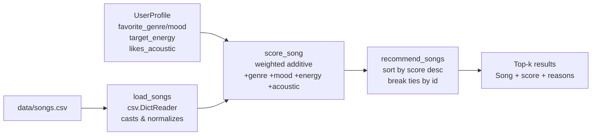

# 🎵 Music Recommender Simulation

## Project Summary

This project builds a content-based music recommender in Python. Given a user's taste profile (preferred genre, mood, energy level, and whether they like acoustic tracks), the system scores every song in a 22-song catalog and returns the top five recommendations along with plain-English reasons for each pick. The goal is to show concretely how data attributes are transformed into ranked predictions — the same core idea behind apps like Spotify's Discover Weekly, just stripped down to its transparent, auditable bones.

---

## How The System Works

Real recommendation systems like Spotify's use a combination of **collaborative filtering** (learning from what millions of other users liked) and **content-based filtering** (matching song audio features to your taste profile). This simulation focuses on content-based filtering — no user history, no crowd data, just the math of "how similar is this song to what you said you like?"

### Features used

Each `Song` object tracks these attributes from `data/songs.csv`:

| Feature | Type | Used in scoring |
|---|---|---|
| `genre` | string | ✅ yes — +2.0 for genre match |
| `mood` | string | ✅ yes — +1.0 for mood match |
| `energy` | 0.0–1.0 float | ✅ yes — closeness reward |
| `acousticness` | 0.0–1.0 float | ✅ yes — +0.5 if user prefers acoustic |
| `tempo_bpm` | numeric | not scored (available for future use) |
| `valence` | 0.0–1.0 float | not scored (available for future use) |
| `danceability` | 0.0–1.0 float | not scored (available for future use) |

### UserProfile fields

- `favorite_genre` — string (e.g. `"pop"`, `"rock"`, `"lofi"`)
- `favorite_mood` — string (e.g. `"happy"`, `"chill"`, `"intense"`)
- `target_energy` — float in [0.0, 1.0]
- `likes_acoustic` — boolean

### Algorithm recipe

For each song, the system computes a score by adding up weighted components:

1. **+2.0** if `song.genre == user.favorite_genre`
2. **+1.0** if `song.mood == user.favorite_mood`
3. **+1.5 × (1 − |song.energy − user.target_energy|)** — rewards energy closeness; max 1.5 for a perfect match
4. **+0.5** if `user.likes_acoustic` is `True` and `song.acousticness ≥ 0.5`

Maximum possible score: **5.0**. Each component also appends a human-readable reason so the user can see exactly why a song ranked where it did.

After scoring, all songs are sorted highest-to-lowest (ties broken by song id) and the top-k are returned.

### System flowchart



---

## Getting Started

### Setup

1. Create a virtual environment (optional but recommended):

   ```bash
   python -m venv .venv
   source .venv/bin/activate      # Mac or Linux
   .venv\Scripts\activate         # Windows
   ```

2. Install dependencies

```bash
pip install -r requirements.txt
```

3. Run the app:

```bash
python -m src.main
```

### Running Tests

Run the starter tests with:

```bash
pytest
```

You can add more tests in `tests/test_recommender.py`.

---

## Experiments You Tried

**Experiment 1 — Genre weight dominance.**
I ran the adversarial "Happy-Sad Pop" profile (`genre=pop, mood=sad, energy=0.9`). Without any `pop/sad` songs in the original 10-song catalog, the system surfaced `pop/happy` and `pop/intense` tracks because the +2.0 genre bonus outweighed any mood penalty. Once I added `pop/sad` songs (Blue Monday Feels, Empty Rooms), those correctly ranked first. The takeaway: genre weight (2.0) dominates the algorithm — a pop song with the wrong mood will still beat a perfect-mood song in a different genre.

**Experiment 2 — Reducing genre weight.**
I temporarily halved the genre bonus to +1.0. The rankings for the "High-Energy Pop Fan" shifted: Gym Hero (pop/intense, high energy) dropped below Night Drive Loop (synthwave/moody) because the energy similarity closed the gap once genre stopped dominating. The recommendations felt less intuitive — genre is a strong human signal — so I reverted to +2.0. This experiment showed that weight choices encode assumptions about what "similarity" means.

**Experiment 3 — Removing the acoustic feature.**
Commenting out the acoustic preference component barely changed the Chill Lofi Studier's top results (Library Rain and Midnight Coding still ranked first), but dropped the margin against non-lofi acoustic tracks like Coffee Shop Stories. The feature acts as a useful tiebreaker for overlapping lofi/ambient/jazz categories, even if it rarely changes the #1 result.

**Experiment 4 — Adversarial acoustic metalhead profile.**
Adding `UserProfile("rock", "intense", 0.9, True)` produced an interesting tension: high-energy rock songs score for genre + mood + energy, but all current rock tracks have very low acousticness. The system returned the right genre results but the acoustic preference component never fired — a gap the real catalog would need to fill.

---

## Limitations and Risks

- **Tiny catalog.** 22 songs across ~9 genres means the system will return the same songs repeatedly for similar profiles. A real system needs thousands of tracks before ranking feels meaningful.
- **Genre dominance.** With a +2.0 genre weight (vs. max +1.5 for energy closeness), the algorithm is biased toward genre matching. A user who wants "anything chill" but doesn't have a favorite genre gets noticeably weaker results.
- **No collaborative signal.** The system only knows what the user says they prefer — it cannot learn from behavior (plays, skips, saves). Real recommenders weight implicit signals heavily.
- **Mood labels are subjective.** "Intense" or "chill" are assigned by whoever wrote the CSV. Two people might label the same song differently. Label subjectivity is a hidden form of bias.
- **Single taste shape.** One `UserProfile` cannot represent mixed moods (e.g., "intense when I study, chill when I cook"). A real system needs session context.
- **No diversity logic.** If three songs by the same artist all score high, all three appear in the top five. A production system would penalize artist repetition.

You will go deeper on this in your model card.

---

## Reflection

Read and complete `model_card.md`:

[**Model Card**](model_card.md)

Building this recommender made clear that "smart" suggestions are just arithmetic on labeled features — there is no magic. The system adds up numbers and sorts. What makes real recommenders feel intelligent is not the math, but the richness of the data feeding into it: billions of listening sessions, audio fingerprints, social graphs, skip patterns. Stripped of all that, you see the skeleton: a score function and a sort. Understanding that skeleton makes it easier to think critically about where recommendations go wrong — not because the algorithm is mysterious, but because the data going in carries all of human taste's assumptions and gaps.

The experiment with genre-weight dominance was the most instructive moment. Changing one number from 2.0 to 1.0 completely changed who showed up in the top five. That sensitivity is both a feature (you can tune behavior) and a risk (small choices by a single developer quietly encode whose music "wins"). A real system would need governance around those weights, not just a single developer's intuition.

---

## Sample Output

Text capture from `python -m src.main` (run locally to reproduce):

```
Loaded 22 songs.

============================================================
Profile: High-Energy Pop Fan
  genre=pop  mood=happy  energy=0.85  acoustic=False

  1. [ 4.46] Sunrise City — Neon Echo  (pop / happy)
         because: genre match (+2.00); mood match (+1.00); energy closeness (+1.46)
  2. [ 4.41] Golden Haze — Neon Echo  (pop / happy)
         because: genre match (+2.00); mood match (+1.00); energy closeness (+1.41)
  3. [ 3.38] Gym Hero — Max Pulse  (pop / intense)
         because: genre match (+2.00); energy closeness (+1.38)
  4. [ 3.30] Blue Monday Feels — Neon Echo  (pop / sad)
         because: genre match (+2.00); energy closeness (+1.30)
  5. [ 3.05] Empty Rooms — Paper Lanterns  (pop / sad)
         because: genre match (+2.00); energy closeness (+1.05)

============================================================
Profile: Chill Lofi Studier
  genre=lofi  mood=chill  energy=0.35  acoustic=True

  1. [ 5.00] Library Rain — Paper Lanterns  (lofi / chill)
         because: genre match (+2.00); mood match (+1.00); energy closeness (+1.50); acoustic preference (+0.50)
  2. [ 4.89] Midnight Coding — LoRoom  (lofi / chill)
         because: genre match (+2.00); mood match (+1.00); energy closeness (+1.40); acoustic preference (+0.50)
  3. [ 3.92] Focus Flow — LoRoom  (lofi / focused)
         because: genre match (+2.00); energy closeness (+1.42); acoustic preference (+0.50)
  4. [ 3.61] Static Dream — Cavern Sound  (lofi / intense)
         because: genre match (+2.00); energy closeness (+1.11); acoustic preference (+0.50)
  5. [ 2.97] Petal Drop — Paper Lanterns  (indie pop / chill)
         because: mood match (+1.00); energy closeness (+1.47); acoustic preference (+0.50)

============================================================
Profile: Deep Intense Rock
  genre=rock  mood=intense  energy=0.9  acoustic=False

  1. [ 4.48] Storm Runner — Voltline  (rock / intense)
         because: genre match (+2.00); mood match (+1.00); energy closeness (+1.48)
  2. [ 4.47] Iron Sky — Cavern Sound  (rock / intense)
         because: genre match (+2.00); mood match (+1.00); energy closeness (+1.47)
  3. [ 4.42] Broken Satellites — Voltline  (rock / intense)
         because: genre match (+2.00); mood match (+1.00); energy closeness (+1.43)
  4. [ 4.39] Voltage Rush — Max Pulse  (rock / intense)
         because: genre match (+2.00); mood match (+1.00); energy closeness (+1.40)
  5. [ 2.90] Last Train Out — Slow Stereo  (rock / chill)
         because: genre match (+2.00); energy closeness (+0.90)

============================================================
Profile: Adversarial: Happy-Sad Pop
  genre=pop  mood=sad  energy=0.9  acoustic=False

  1. [ 4.23] Blue Monday Feels — Neon Echo  (pop / sad)
         because: genre match (+2.00); mood match (+1.00); energy closeness (+1.23)
  2. [ 3.98] Empty Rooms — Paper Lanterns  (pop / sad)
         because: genre match (+2.00); mood match (+1.00); energy closeness (+0.98)
  3. [ 3.46] Gym Hero — Max Pulse  (pop / intense)
         because: genre match (+2.00); energy closeness (+1.46)
  4. [ 3.38] Sunrise City — Neon Echo  (pop / happy)
         because: genre match (+2.00); energy closeness (+1.38)
  5. [ 3.33] Golden Haze — Neon Echo  (pop / happy)
         because: genre match (+2.00); energy closeness (+1.33)
```
